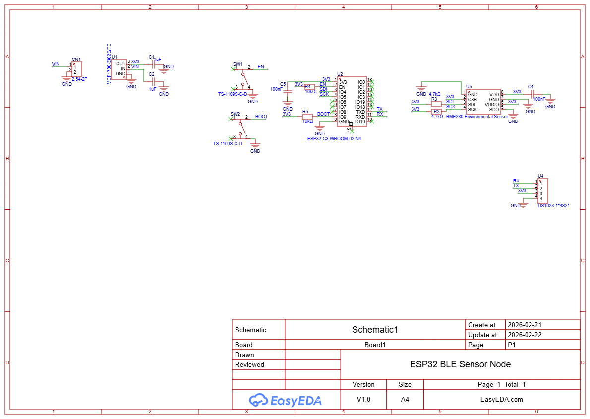

# BLE Sensor Node – ESP32-C3 + BME280

## 🧠 Overview
This project simulates a low-power BLE sensor node using the ESP32-C3 and BME280 environmental sensor. The node is designed for wireless data transmission over BLE, with onboard voltage regulation and I²C communication between components.

## 🔧 Project Scope
- Simulated using EasyEDA (schematic + layout)
- Designed for low-power applications (battery-powered)
- Environmental sensing via BME280 (temperature, humidity, pressure)
- BLE transmission using ESP32-C3 onboard radio
- Regulated via MCP1700 3.3V LDO for sensor stability
# Hardware Design – ESP32 BLE Environmental Sensor Node

Designed and implemented a custom hardware platform using the ESP32-C3-WROOM-02 module and BME280 environmental sensor. The system includes regulated 3.3V power supply using an LDO with proper input/output decoupling, I²C pull-up configuration, boot and reset circuitry with external resistors, and UART programming interface.

Implemented correct I²C hardware configuration (CSB high for I²C mode, SDO grounded for 0x76 address) and ensured RF performance by maintaining PCB antenna keepout and ground plane clearance. The design was first validated on breadboard and later translated into PCB layout with proper power routing and decoupling practices.

## 🖼️ Schematic

# PCB

## 📂 Gerber Files

Download manufacturing files here:

[Gerber ZIP](hardware/Gerber.zip)

## ⚙️ Components
- ESP32-C3-WROOM-02-N4
- BME280 Sensor (I²C)
-  3.3V LDO
- Pull-up resistors for I²C lines

## 📎 Project Files
- Schematic (`.png`)
- images/pcb_layout.png
- images/pcb_2d.png
- images/pcb_3d.png 
- hardware/Gerber.zip
  

